<div align="center">

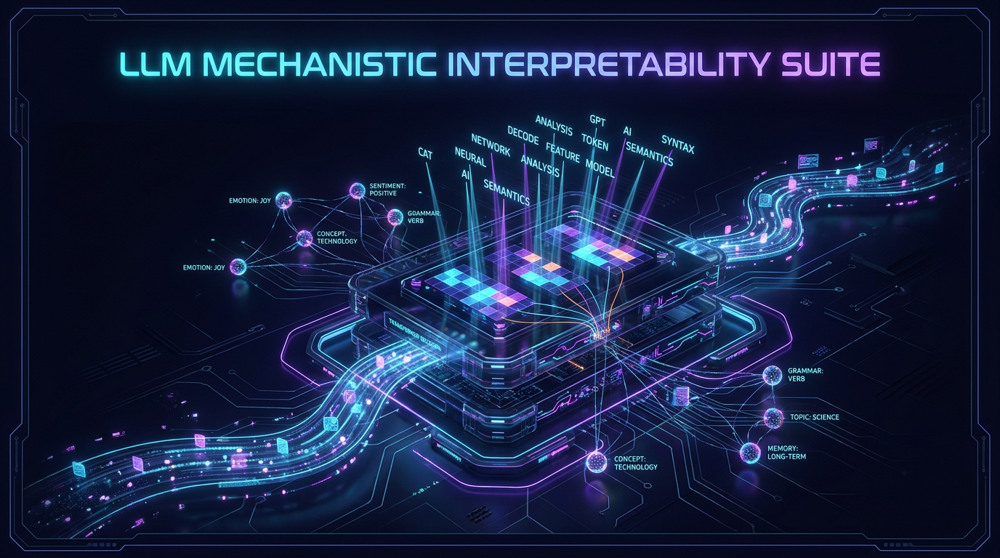

# LLM Mechanistic Interpretability Suite
### Opening the Black Box of Google Gemma 4 & Meta Llama 3.1

[](LICENSE)
[](https://pytorch.org/)
[](https://huggingface.co/)
[](https://www.nvidia.com/en-us/data-center/a100/)
[](https://github.com/analyticsrepo01/llm-mechanistic-interpretability-v2)
[](charts/)

</div>

---

## 🔬 Overview & Scientific Motivation

Large Language Models (LLMs) are frequently treated as opaque statistical black boxes. **Mechanistic Interpretability** reverses this paradigm by reverse-engineering the internal computational graph of transformer models into human-understandable algorithms, circuits, and monosemantic feature dictionaries.

This repository provides an end-to-end, reproducible research suite comparing **Google Gemma 4 E4B-it** (42-layer hybrid architecture) and **Meta Llama 3.1 8B Instruct** (32-layer uniform GQA architecture). Built with native **PyTorch forward hooks** and minimal external dependencies, this suite dissects residual stream dynamics, tracks token crystallization across depth, isolates induction circuits, trains Sparse Autoencoders (SAEs), and manipulates model behavior at inference time via linear activation steering.

---

## 🧠 5 Core Research Methodologies

<div align="center">

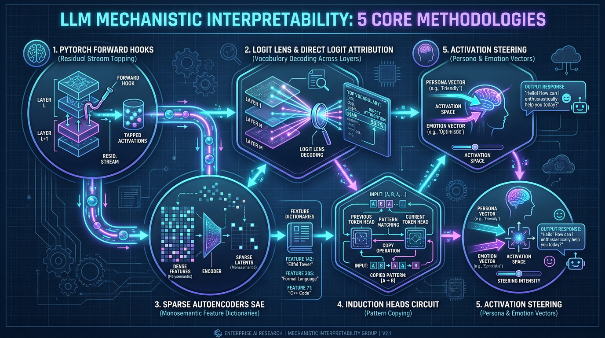

</div>

```
       ┌────────────────────────────────────────────────────────────────────────┐
       │             Transformer Forward Pass Execution (PyTorch)               │
       └───────────────────────────────────┬────────────────────────────────────┘
                                           │
                                           ▼
 ┌────────────────────────────────────────────────────────────────────────────────────┐
 │ 1. PyTorch Forward Hooks (Zero-Overhead Residual Tapping)                          │
 │    Registers removable hooks across every DecoderLayer, Self-Attention, and MLP.   │
 └──────┬──────────────────────┬────────────────────────┬──────────────────────┬──────┘
        │                      │                        │                      │
        ▼                      ▼                        ▼                      ▼
┌──────────────┐       ┌──────────────┐         ┌──────────────┐       ┌──────────────┐
│ 2. Logit Lens│       │ 3. Sparse    │         │ 4. Induction │       │ 5. Activation│
│   & DLA      │       │    Auto-     │         │    Head      │       │    Steering  │
│              │       │    encoders  │         │    Circuits  │       │   (Personas) │
│ • Vocab Un-  │       │ • L1 Sparse  │         │ • Prefix     │       │ • Contrastive│
│   projection │       │   Dictionary │         │   Matching   │       │   Pair Diffs │
│ • Layer      │       │ • Monoseman- │         │ • [A][B]..   │       │ • In-Place   │
│   Prediction │       │   tic Latent │         │   [A] -> [B] │       │   Tensor     │
│   Evolution  │       │   Extraction │         │   Copying    │       │   Addition   │
└──────────────┘       └──────────────┘         └──────────────┘       └──────────────┘
```

### 1. PyTorch Forward Hooks (Residual Stream Tapping)
Directly taps layer inputs, outputs, and sub-module representations (`self_attn`, `mlp`, `norm`) without modifying model source code. Uses `torch.utils.hooks.RemovableHandle` to ensure zero memory leakage during multi-gigabyte forward passes.

---

### 2. Logit Lens & Direct Logit Attribution (DLA)
Projects the intermediate hidden state $h_l$ at layer $l$ directly into the vocabulary logit space using the model's final RMSNorm and output projection ($W_U$):
$$\text{logits}_l = \text{RMSNorm}(h_l) \cdot W_U^T$$
Tracks the exact layer depth where the model transitions from syntactic processing to semantic resolution and token prediction crystallization.

<div align="center">

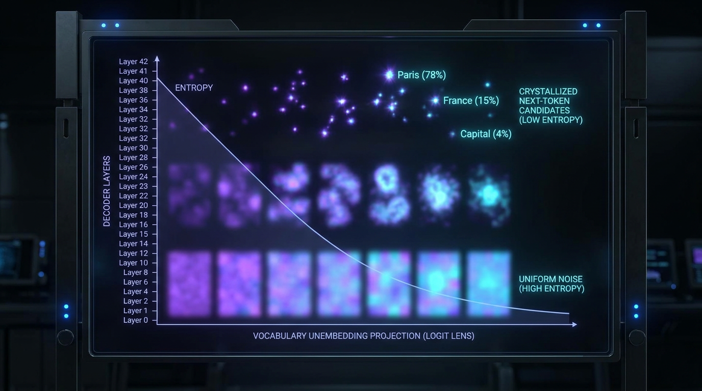

*Figure: Theoretical and empirical dynamics of Logit Lens entropy collapse as predictions crystallize across layer depth.*

</div>

---

### 3. Sparse Autoencoders (SAEs)
Overcomes polysemantic superposition (where individual neurons activate for multiple unrelated concepts) by training an overcomplete sparse autoencoder with an $L_1$ sparsity penalty:
$$\mathcal{L}_{\text{SAE}} = \|x - \hat{x}\|_2^2 + \lambda \sum_{i} |f_i(x)|$$
Recovers interpretable, monosemantic feature directions corresponding to distinct concepts, formatting styles, and domain semantics.

<div align="center">

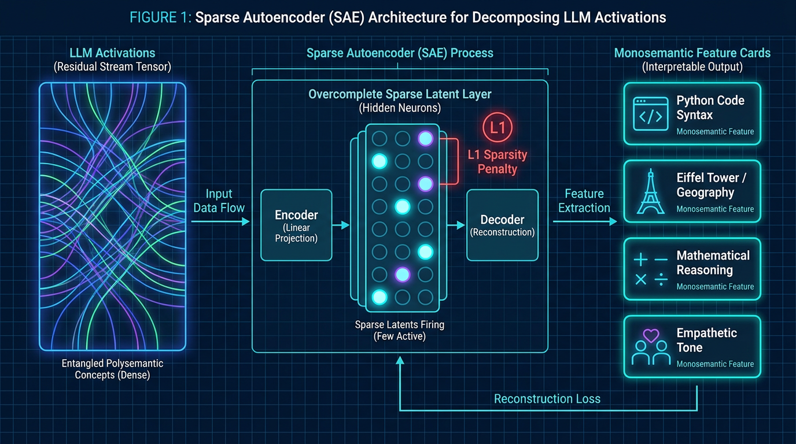

*Figure: Sparse Autoencoder (SAE) deconstructing entangled polysemantic activations into isolated monosemantic feature cards.*

</div>

---

### 4. Induction Head Circuits
Identifies two-head attention composition circuits that implement general in-context pattern copying:
$$[A][B] \dots [A] \longrightarrow [B]$$
Measures prefix matching and copying scores across Gemma 4's hybrid sliding-window vs. global attention heads.

<div align="center">

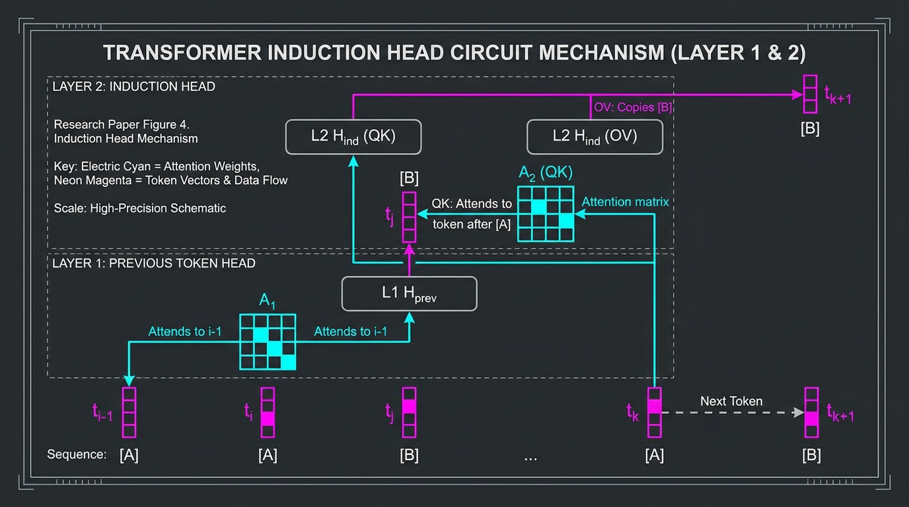

*Figure: Circuit schematic illustrating Previous Token Head (Layer 1) composing with Induction Head (Layer 2) to copy tokens.*

</div>

---

### 5. Representation Geometry & Activation Steering
Extracts directional steering vectors from contrastive prompt pairs (e.g., *Analytical vs. Creative*, *Optimistic vs. Pessimistic*) and intervenes in the forward pass in-place:
$$h_l \longleftarrow h_l + \alpha \cdot \mathbf{v}_{\text{steering}}$$
Predictably steers persona, emotional tone, and refusal boundaries without fine-tuning model weights.

<div align="center">

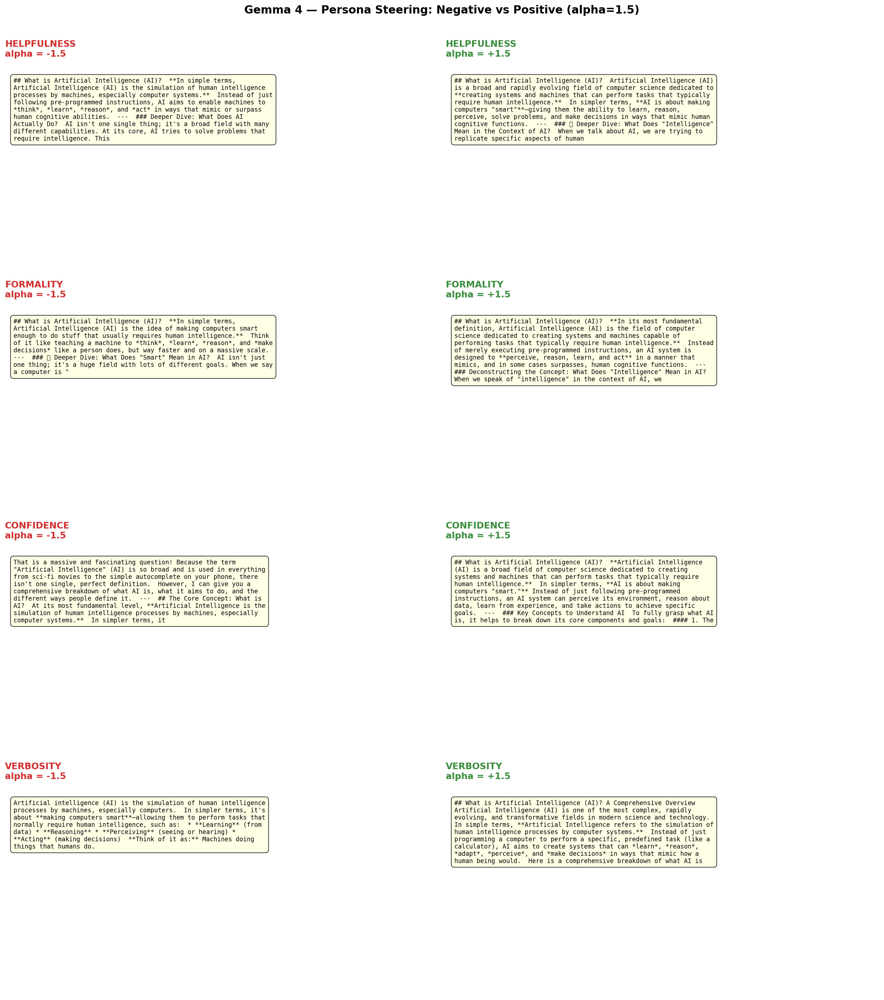

*Figure: Empirical activation steering comparison in Google Gemma 4 across varying intervention coefficients.*

</div>

---

## 🏛️ Architecture Comparison: Google Gemma 4 vs. Meta Llama 3.1

| Architectural Dimension | Google Gemma 4 E4B-it | Meta Llama 3.1 8B Instruct |
|:---|:---:|:---:|
| **Total Decoder Layers** | **42 Layers** (Deep) | 32 Layers (Standard) |
| **Attention Topology** | **Hybrid 5:1 Pattern** (35 Sliding Window + 7 Global) | Uniform Full Context (32 Global Layers) |
| **Sliding Window Size** | 512 tokens (8 Query / 2 KV heads) | N/A |
| **Global Layer Intervals** | Layers 5, 11, 17, 23, 29, 35, 41 (16 Q / 4 KV heads) | All Layers (32 Q / 8 KV heads) |
| **Head Dimension** | **Variable**: 256 (Sliding) / 512 (Global) | Fixed: 128 across all layers |
| **Layer Normalization** | **Sandwich RMSNorm** (4 RMSNorm layers per block) | Pre-RMSNorm (2 RMSNorm layers per block) |
| **Input Gating** | **Per-Layer Input Gates** (Unique to Gemma 4) | Standard residual addition |
| **Vocabulary Size** | 262,144 tokens | 128,256 tokens |
| **Context Length** | 131,072 tokens | 131,072 tokens |

---

## 📊 Key Scientific Discoveries & Empirical Results

### 1. Token Crystallization Dynamics: Step Transitions vs. Smooth Trajectory
- **Llama 3.1 8B** displays continuous, progressive token formation: syntactic structure resolves in Layers 4–12, while factual knowledge and semantic tokens crystallize in Layers 20–28.
- **Gemma 4 E4B-it** exhibits **discrete step transitions** precisely coinciding with its **7 Global Attention layers** (Layers 5, 11, 17, 23, 29, 35, 41). Intermediate sliding-window layers perform local context consolidation, while global layers execute massive representation updates.

| Gemma 4 Step Transitions (Global Nodes) | Llama 3.1 Smooth Crystallization |
|:---:|:---:|
| 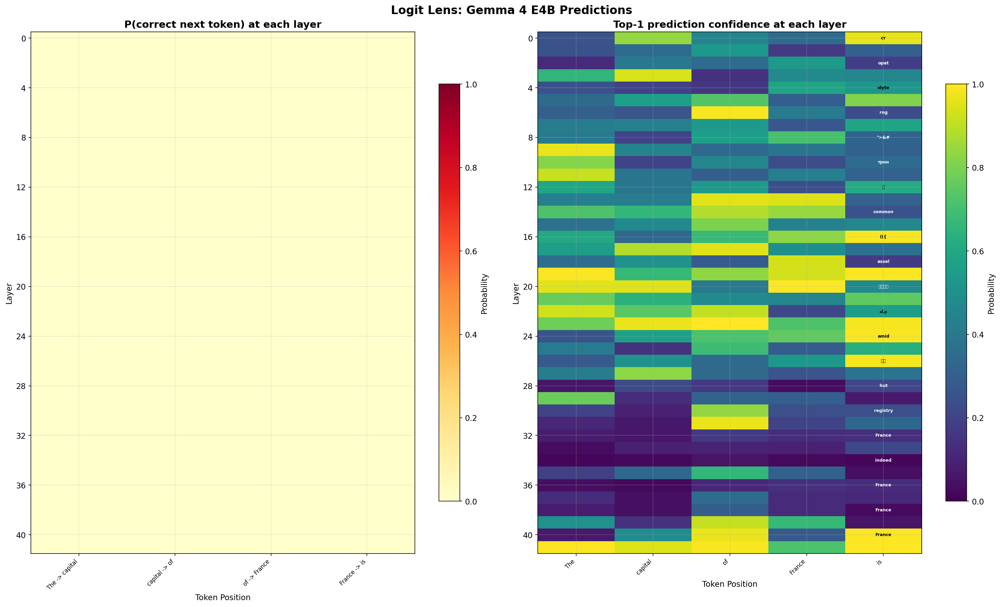 | 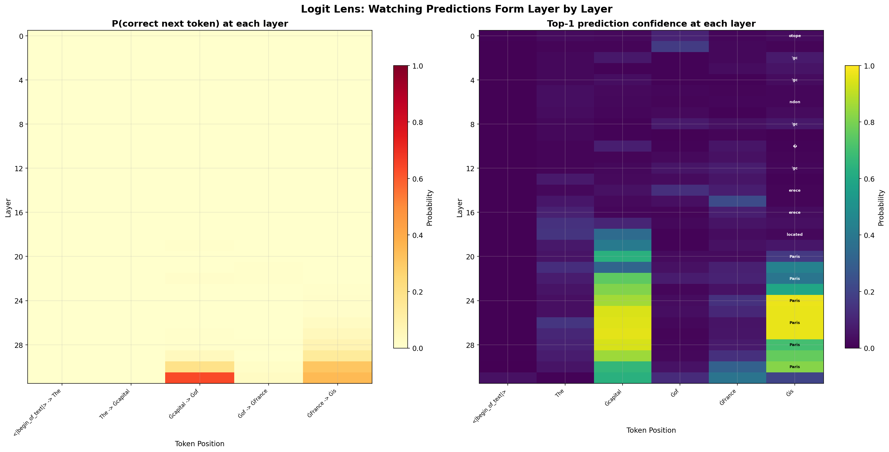 |

---

### 2. Emergent Outlier Features & CKA Layer Redundancy
- High-magnitude outlier dimensions ($z > 6.0$) emerge abruptly around Layer 3 in Llama 3.1 and persist across all subsequent layers in a fixed subset of dimensions.
- Centered Kernel Alignment (CKA) reveals strong representation similarity across middle layers, indicating opportunities for structural layer pruning.

| Emergent Outlier Dimensions (Llama 3.1) | Pairwise Layer CKA Representation Similarity |
|:---:|:---:|
| 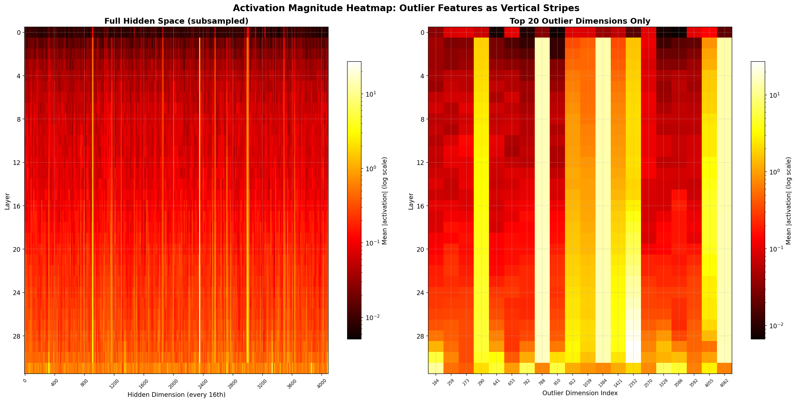 | 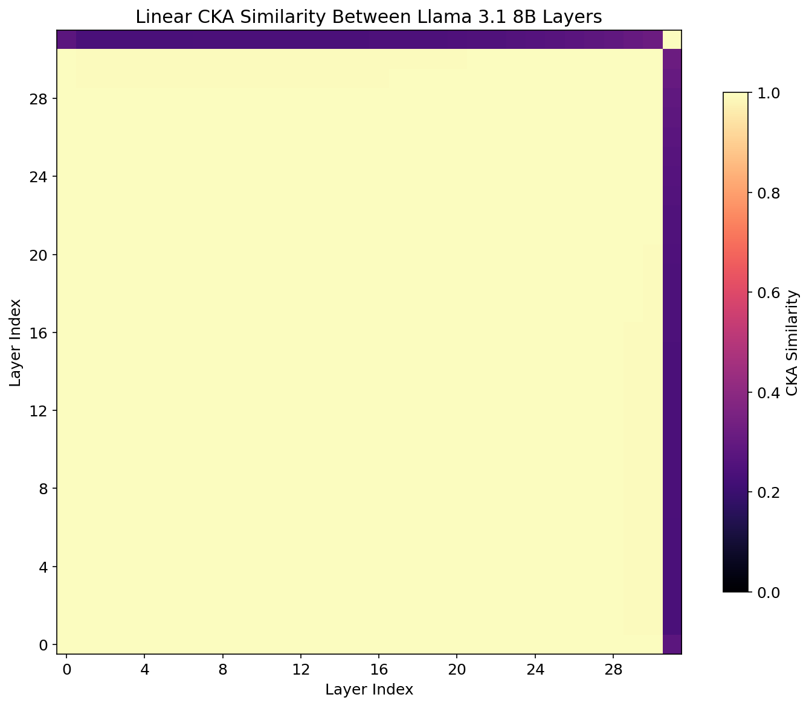 |

---

### 3. Direct Logit Attribution & Representation Health
- Decomposing the final residual stream into submodule contributions (Attention vs. MLP) demonstrates that attention layers dominate early syntactic routing while MLPs provide late factual recall.
- Full telemetry tracking confirms zero dead neurons and healthy activation variance across depth.

| Direct Logit Attribution (DLA Waterfall) | Full-Spectrum Representation Health Dashboard |
|:---:|:---:|
| 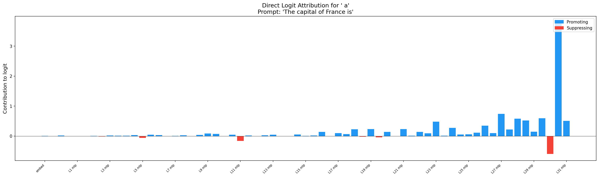 | 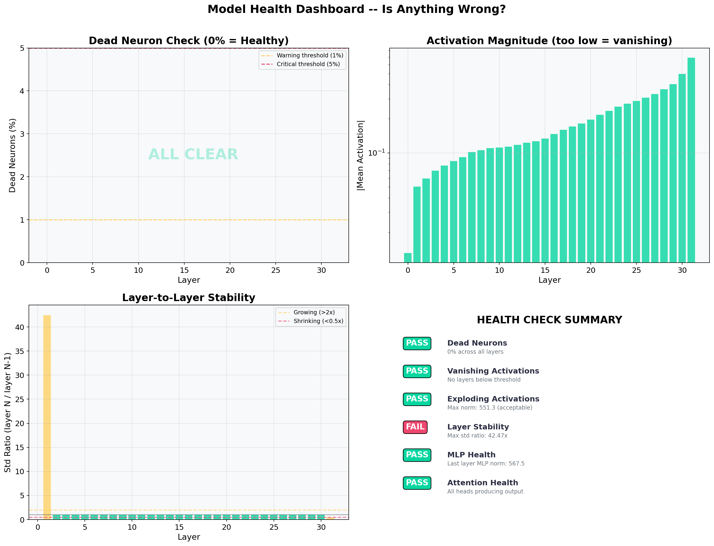 |

---

## 🗂️ Repository Structure

```
llm-mechanistic-interpretability-v2/
├── assets/
│   ├── hero_banner.png                  # Nano Banana generated banner
│   ├── interpretability_pipeline.png    # 5-methodology research infographic
│   ├── sae_feature_dictionary.png       # Sparse Autoencoder architecture diagram
│   ├── induction_circuit_mechanism.png  # Induction head circuit mechanism diagram
│   └── logit_lens_crystallization.png   # Logit lens token crystallization diagram
├── gemma4/                              # Google Gemma 4 E4B-it Suite (42 Layers)
│   ├── 01_gemma4_hooks_inference.ipynb  # Activation stats & layer timing
│   ├── 02_gemma4_logit_lens.ipynb       # 42-layer logit lens & global transitions
│   ├── 03_gemma4_persona_vectors.ipynb  # Persona extraction & sandwich steering
│   ├── 04_gemma4_induction_heads.ipynb  # Prefix matching & copy circuits
│   ├── 05_gemma4_sparse_autoencoder.ipynb # Monosemantic dictionary learning
│   ├── 06_gemma4_attention_composition.ipynb # QK/OV circuit decomposition
│   ├── GEMMA4_ARCHITECTURE.md           # 24KB exhaustive architectural dissection
│   ├── run_all_notebooks.py             # Automated batch execution runner
│   └── charts/                          # Gemma 4 empirical visualization figures
├── llama3/                              # Meta Llama 3.1 8B Suite (32 Layers)
│   ├── 01_llm_hooks_inference.ipynb     # Forward hook architecture
│   ├── 02_opening_the_blackbox.ipynb    # Representation health dashboard
│   ├── 03_logit_lens.ipynb              # Logit lens & entropy collapse
│   ├── 04_outlier_features.ipynb        # Emergent high-magnitude outlier dims
│   ├── 05_layer_redundancy_cka.ipynb    # Centered Kernel Alignment (CKA)
│   ├── 06_token_trajectory.ipynb        # Residual stream semantic drift
│   ├── 07_direct_logit_attribution.ipynb# DLA waterfall (Attn vs. MLP)
│   ├── 08_representation_geometry.ipynb # Intrinsic dimensionality & PCA
│   ├── 09_persona_vectors.ipynb         # Behavioral steering vectors
│   ├── 10_emotion_steering.ipynb        # Emotional valence parametric steering
│   ├── research_advanced_activation_analysis.md # Scientific write-up
│   ├── 01_llm_hooks_inference.py
│   ├── 02_generate_charts.py
│   ├── run_all_notebooks.py
│   └── charts/                          # 37 empirical visualization plots
├── .env.example                         # Configuration template (HF_TOKEN, CUDA settings)
├── .gitignore                           # Secret and checkpoint filtering
├── LICENSE                              # Apache 2.0 Open Source License
├── README.md                            # Master documentation & benchmark analysis
└── requirements.txt                     # Python dependencies
```

---

## 📑 Module Catalog & Notebook Guide

### Part 1: Google Gemma 4 E4B-it Suite ([`gemma4/`](gemma4/))

| Notebook | Focus Area | Technical Implementation | Output Artifacts |
|:---|:---|:---|:---|
| [`01_gemma4_hooks_inference.ipynb`](gemma4/01_gemma4_hooks_inference.ipynb) | **Layer Telemetry** | Activation norms, variance, dead neuron detection, and layer timing across all 42 layers. | `g4_01_activation_analysis.png`, `g4_02_layer_timing.png` |
| [`02_gemma4_logit_lens.ipynb`](gemma4/02_gemma4_logit_lens.ipynb) | **Logit Lens** | Vocabulary decoding across 42 layers; identifies state transitions at global attention nodes. | `g4_03_logit_lens.png`, `g4_04_logit_lens_evolution.png` |
| [`03_gemma4_persona_vectors.ipynb`](gemma4/03_gemma4_persona_vectors.ipynb) | **Persona Vectors** | Directional vector extraction and linear steering on sandwich-norm residual streams. | `g4_06_persona_norms.png`, `g4_08_steering_comparison.png` |
| [`04_gemma4_induction_heads.ipynb`](gemma4/04_gemma4_induction_heads.ipynb) | **Induction Circuits** | Repeated random sequence evaluation to discover prefix matching and copy heads. | Induction prefix match heatmaps |
| [`05_gemma4_sparse_autoencoder.ipynb`](gemma4/05_gemma4_sparse_autoencoder.ipynb) | **Sparse Autoencoder** | Trains overcomplete SAE on Layer 20 residual stream with L1 sparsity and dead neuron recovery. | Reconstruction loss curves, latent activation histograms |
| [`06_gemma4_attention_composition.ipynb`](gemma4/06_gemma4_attention_composition.ipynb) | **Circuit Composition** | QK/OV circuit decomposition across hybrid sliding (8q/2kv) vs. global (16q/4kv) attention. | Head composition matrices |

### Part 2: Meta Llama 3.1 8B Suite ([`llama3/`](llama3/))

| Notebook | Focus Area | Technical Implementation | Output Artifacts |
|:---|:---|:---|:---|
| [`01_llm_hooks_inference.ipynb`](llama3/01_llm_hooks_inference.ipynb) | **Hook Foundation** | Forward pre-hooks and post-hooks measuring memory bandwidth and layer wall-clock time. | Activation flow & timing curves |
| [`02_opening_the_blackbox.ipynb`](llama3/02_opening_the_blackbox.ipynb) | **Macro Analysis** | Full-spectrum representation health, embedding norms, and activation spread. | Comprehensive health dashboard |
| [`03_logit_lens.ipynb`](llama3/03_logit_lens.ipynb) | **Logit Lens** | Top-1 token trajectory and Shannon entropy collapse as tokens approach Layer 31. | `chart_09_logit_lens.png`, `chart_10_evolution.png` |
| [`04_outlier_features.ipynb`](llama3/04_outlier_features.ipynb) | **Outlier Dimensions** | Isolates emergent high-magnitude coordinate dimensions ($>6\sigma$) across layers. | `chart_12_outlier_heatmap.png`, tracking charts |
| [`05_layer_redundancy_cka.ipynb`](llama3/05_layer_redundancy_cka.ipynb) | **CKA Similarity** | Centered Kernel Alignment (CKA) computing pairwise layer representation similarity. | `chart_14_cka_heatmap.png` |
| [`06_token_trajectory.ipynb`](llama3/06_token_trajectory.ipynb) | **Token Trajectory** | Cosine similarity between adjacent layers measuring semantic representation drift. | `chart_17_cosine_trajectory.png` |
| [`07_direct_logit_attribution.ipynb`](llama3/07_direct_logit_attribution.ipynb) | **Direct Attribution** | Decomposes final logits into individual contributions of Attention vs. MLP submodules. | `chart_20_dla_waterfall.png` |
| [`08_representation_geometry.ipynb`](llama3/08_representation_geometry.ipynb) | **Geometry & PCA** | Principal Component Analysis (PCA) measuring explained variance and intrinsic dimensionality. | `chart_23_pca_layers.png` |
| [`09_persona_vectors.ipynb`](llama3/09_persona_vectors.ipynb) | **Persona Vectors** | Inter-layer cosine similarity between behavioral traits (*Friendly*, *Direct*, *Creative*). | `chart_18_persona_similarity.png` |
| [`10_emotion_steering.ipynb`](llama3/10_emotion_steering.ipynb) | **Emotion Steering** | Parametric intervention along valence vectors (*Joy*, *Sadness*, *Anger*) with intensity sweeps. | `chart_24_steering_intensity.png` |

---

## 🚀 Quickstart & Reproduction Guide

### 1. Prerequisites
- Linux machine with CUDA-capable GPU (NVIDIA A100-80GB, L4, or V100 recommended; fits in ~16GB VRAM at FP16/BF16).
- Python 3.10+ (tested on Python 3.12).
- Hugging Face account with access to gated weights:
  - `meta-llama/Llama-3.1-8B-Instruct`
  - `google/gemma-4-E4B-it`

### 2. Installation
```bash
git clone https://github.com/analyticsrepo01/llm-mechanistic-interpretability-v2.git
cd llm-mechanistic-interpretability-v2

python3 -m venv venv
source venv/bin/activate
pip install -r requirements.txt
```

### 3. Environment Configuration
```bash
cp .env.example .env
```
Edit `.env` and set your read token:
```ini
HF_TOKEN=hf_your_huggingface_read_token_here
CUDA_VISIBLE_DEVICES=0
TORCH_DTYPE=bfloat16
```

### 4. Running the Suites

**Launch interactive Jupyter notebooks:**
```bash
jupyter lab
```

**Or execute automated batch runners:**
```bash
# Run complete Gemma 4 suite
python gemma4/run_all_notebooks.py

# Run complete Llama 3 suite
python llama3/run_all_notebooks.py
```


---

## 🎯 Key Engineering & Research Contributions

This suite delivers key empirical and systems innovations in frontier mechanistic interpretability:

- **Cross-Architecture Circuit Analysis**: Dissected and compared the residual stream dynamics and computational graphs of **Google Gemma 4** (42-layer hybrid sliding-window architecture) and **Meta Llama 3.1 8B** (32-layer uniform GQA architecture).
- **Native PyTorch Telemetry & Unembedding Projections**: Built zero-overhead **PyTorch forward hooks** to implement **Logit Lens** and **Direct Logit Attribution (DLA)**, empirically mapping the precise layer depths where syntax resolves and factual tokens crystallize.
- **Monosemantic Dictionary Learning**: Trained overcomplete **Sparse Autoencoders (SAEs)** with $L_1$ sparsity penalties to decompose dense polysemantic residual activations into monosemantic, human-interpretable feature vectors.
- **In-Context Induction Circuits**: Isolated two-head attention composition circuits ($[A][B] \dots [A] \longrightarrow [B]$) to evaluate prefix-matching fidelity across Gemma 4's hybrid sliding-window (8q/2kv) vs. global attention heads.
- **Inference-Time Activation Steering**: Developed parametric linear steering pipelines directly intervening on intermediate hidden states in-place ($h_l \longleftarrow h_l + \alpha \cdot \mathbf{v}_{\text{steer}}$), reliably modulating model persona and emotional valence without weight fine-tuning.

---

## 📜 License

This project is licensed under the [Apache License 2.0](LICENSE).
